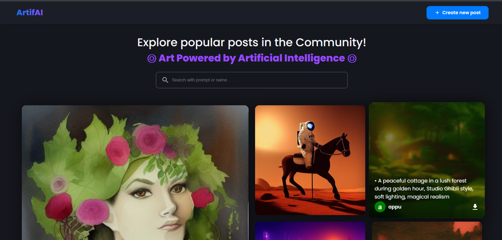
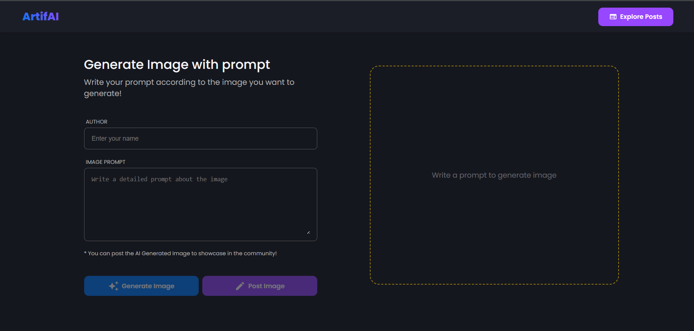
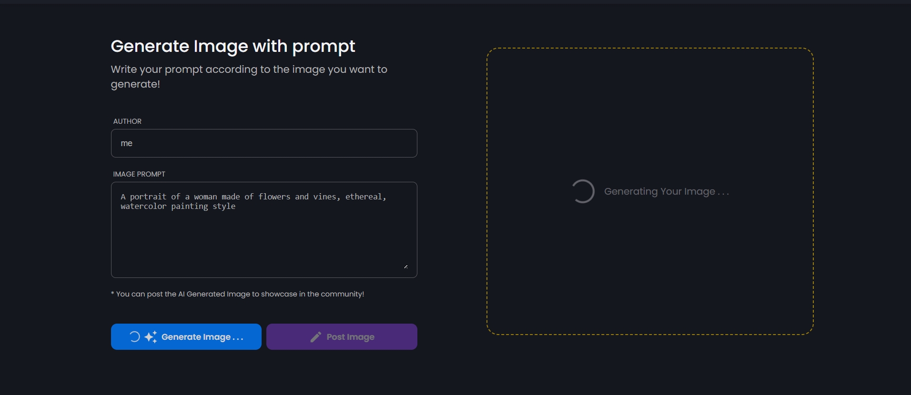

# ArtifAI - AI Image Generation Platform

ArtifAI is a modern web application that allows users to generate, share, and explore AI-generated images. Built with React and Node.js, it leverages the power of Stable Diffusion for image generation and Cloudinary for image storage.

## 📸 Screenshots

### Home Page - Community Gallery

*Explore AI-generated artwork shared by the community*

### Image Generation Interface

*Create your own AI-generated artwork with detailed prompts*

### Generation Process

*Real-time image generation with loading state*

## ✨ Features

- 🎨 AI-powered image generation using Stable Diffusion
- 🖼️ Community image gallery
- 🔍 Search functionality for prompts and authors
- 💾 Cloud storage integration with Cloudinary
- 📱 Responsive design for all devices
- 🌓 Dark theme interface

## 🚀 Tech Stack

### Frontend
- React.js
- Styled Components
- Material-UI Components
- React Router
- Axios

### Backend
- Node.js
- Express.js
- MongoDB
- Cloudinary
- Hugging Face API (Stable Diffusion)

## 🛠️ Installation

1. Clone the repository:
```bash
git clone https://github.com/chandan-l-s-me/AI-Image-Generator
cd artifai
```

2. Install dependencies for both frontend and backend:
```bash
# Install backend dependencies
cd server
npm install

# Install frontend dependencies
cd ../client
npm install
```

3. Set up environment variables:

Create a `.env` file in the server directory with the following:
```env
MONGODB_URL=your_mongodb_connection_string
CLOUDINARY_CLOUD_NAME=your_cloudinary_cloud_name
CLOUDINARY_API_KEY=your_cloudinary_api_key
CLOUDINARY_API_SECRET=your_cloudinary_api_secret
HUGGING_FACE_API_KEY=your_hugging_face_api_key
```

4. Start the development servers:

For backend:
```bash
cd server
npm start
```

For frontend:
```bash
cd client
npm start
```

## 📝 Usage

1. Visit `http://localhost:3000` in your browser
2. Click "Create new post" to generate an image
3. Enter your prompt and click "Generate"
4. Once satisfied with the generated image, fill in the details and share
5. Explore other community-generated images in the gallery


## 🙏 Acknowledgments

- [Hugging Face](https://huggingface.co/) for their Stable Diffusion API
- [Cloudinary](https://cloudinary.com/) for image hosting
- [MongoDB](https://www.mongodb.com/) for database services

## 📧 Contact

Your Name - [ccls65903@gmail.com](mailto:ccls65903@gmail.com)

Project Link: [https://github.com/chandan-l-s-me/AI-Image-Generator](https://github.com/chandan-l-s-me/AI-Image-Generator) 
